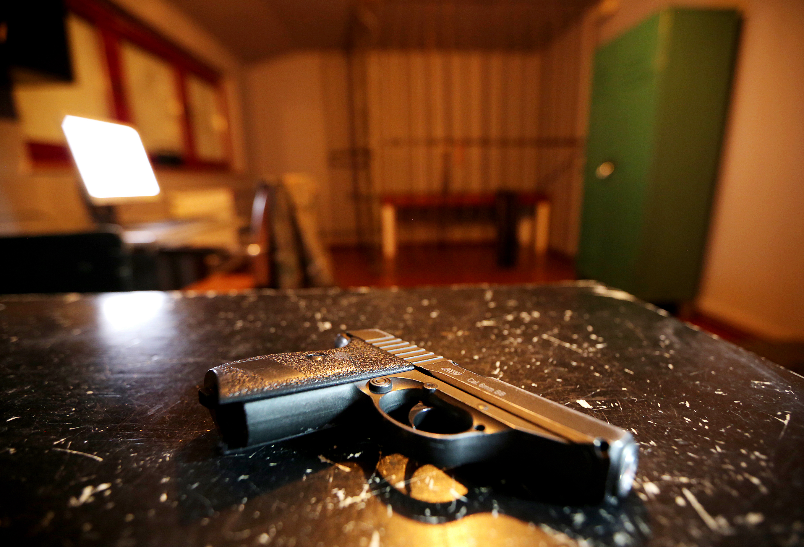

*Zostaliście skazani na wyrok śmierci. Za godzinę rozpocznie się egzekucja. Spróbujcie uciec zanim zacznie się Wasz koniec.*

Do moich obowiązków należało:
- główna wizja gry
- przygotowanie skryptu rozgrywki
- projektowanie lokacji
- projektowanie zagadek
- projektowanie scenografii i rekwizytów
- współpraca z artystami, elektronikami, rzemieślnikami odpowiedzialnymi za stworzenie rekwizytów
- koordynacja testów
- analiza wpływu rozdzielania grupy na motywację i zaangażowanie graczy

Zespół graczy podzielony jest na dwie niezależne grupy na 1/3 rozgrywki. Główny nacisk jest położony na komunikację międzyzespołową. 

Liczba graczy: **2-6**

Czas gry: **do 60 minut**

Lokacje: 2

Poziom trudności: 2/3 

