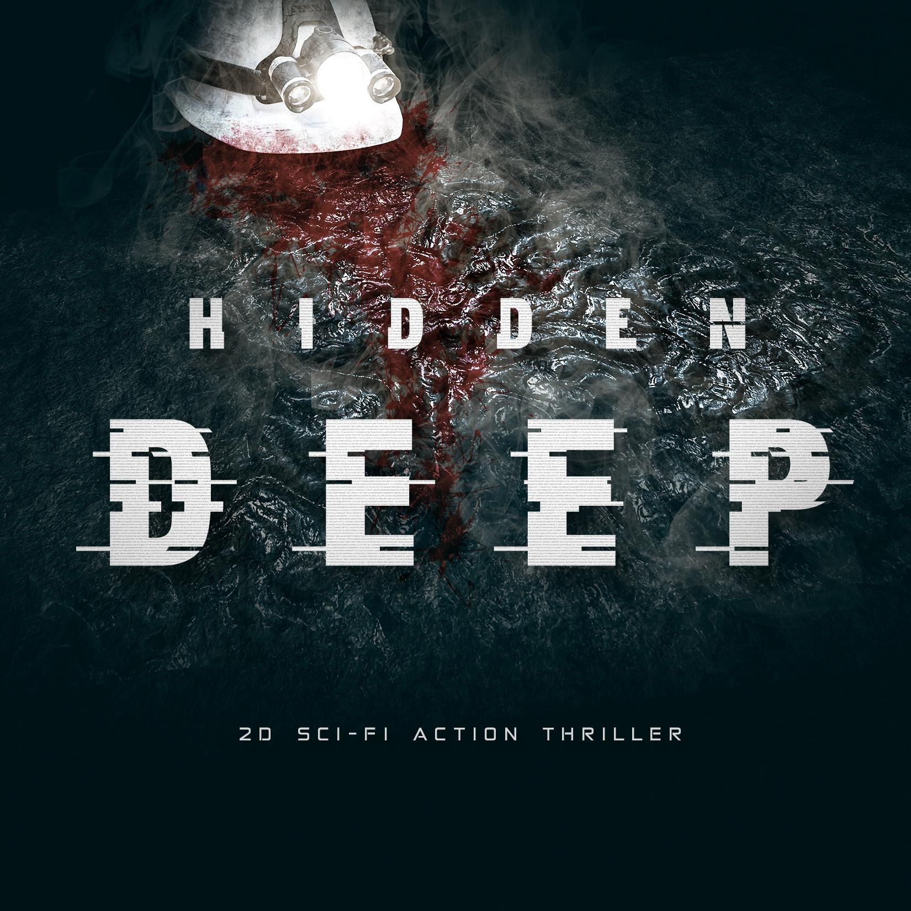

Do moich obowiązków należało:
    - Własne projekty poziomów od koncepcji do końcowych etapów
    - Układanie i rówoważenie rozgrywki
    - Wdrażanie wydarzeń fabularnych i dialogów na poziomach
    - Wdrażanie logiki w grze
    - Projektowanie mechaniki i rozgrywki

Steam: 
https://store.steampowered.com/app/976890/Hidden_Deep/

- Day 82, We found someoned - https://www.youtube.com/watch?v=0gCciJsRP9k
- Day 85, The Connection - https://www.youtube.com/watch?v=ta4NReiS--g
- Day 86, Cut off - https://www.youtube.com/watch?v=80Bh99iDU_c

