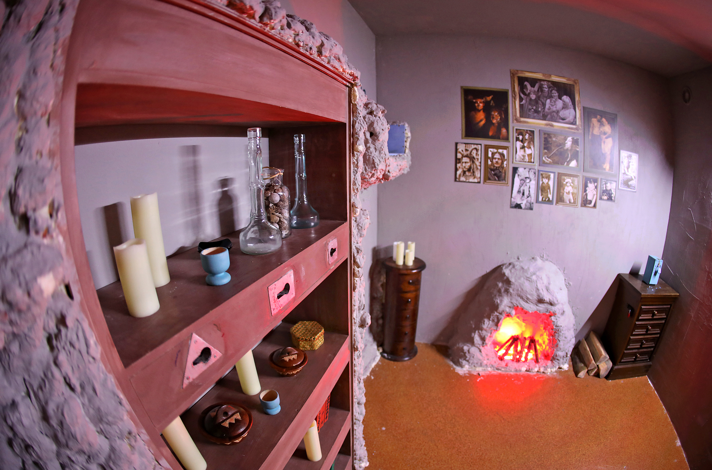

*Od pewnego czasu krążą pogłoski o zaczarowanej krainie i panującej tam wojnie. Wraz z przyjaciółmi znajdujecie list jednego z mieszkańców, który prosi o pomoc w ratunku zniewolonych towarzyszy. Nie wiele myśląc postanawiacie odnaleźć przejście łączące dwa światy, aby pomóc w przywróceniu pokoju. Czy wystarczy Ci czasu, by nie tylko wspomóc mieszkańców, ale i odnaleźć królewskie insygnia?*

Do moich obowiązków należało:
- główna wizja gry
- przygotowanie skryptu rozgrywki
- projektowanie lokacji
- projektowanie zagadek
- projektowanie scenografii i rekwizytów
- współpraca z artystami, elektronikami, rzemieślnikami odpowiedzialnymi za stworzenie rekwizytów
- koordynacja testów

Możliwość zakończenia gry na dwa różne sposovy. Zadania wykorzystujące 4 zmysły graczy oraz kooperacje. Gracz czuje się na każdym kroku jak odkrywcą nieznanego świata.

Liczba graczy: **2-4**

Czas gry: **do 90 minut**

Lokacje: 3

Poziom trudności: 3/3

